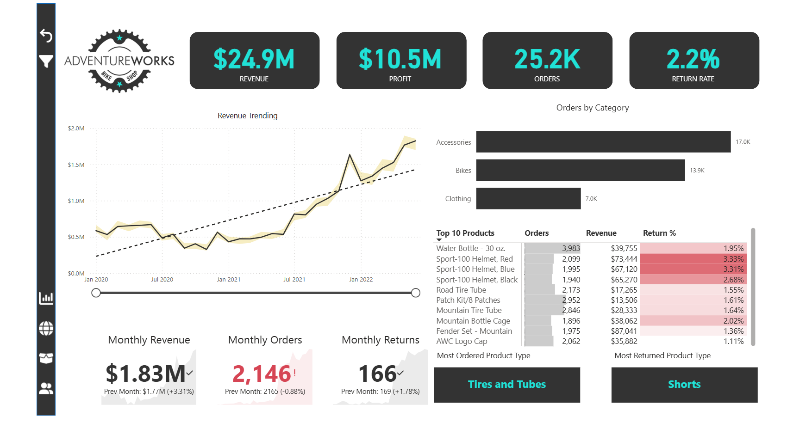
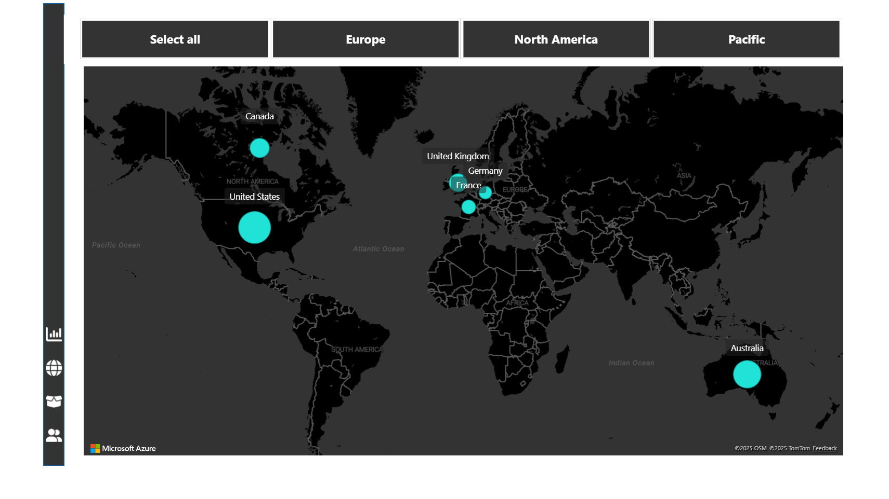
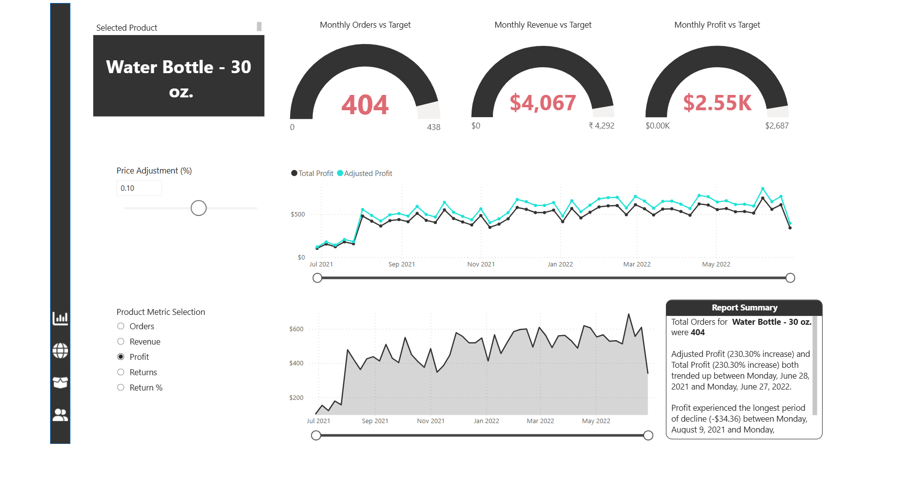
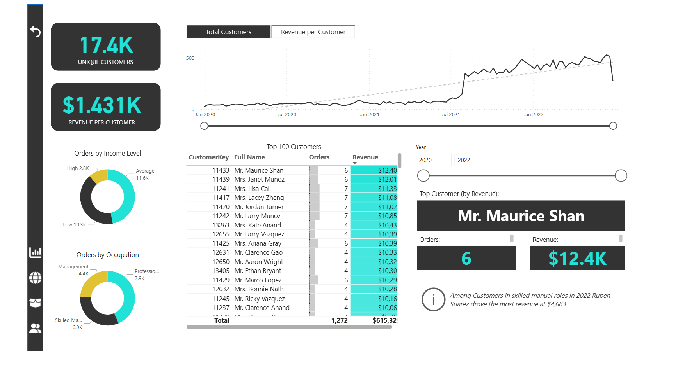
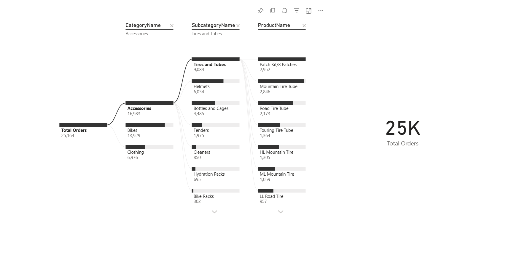

# Adventure Works Power BI Dashboard

## Introduction
This project demonstrates the creation of interactive **Power BI dashboards** for Adventure Works, analyzing sales, revenue, profit, returns, regional performance, product trends, and customer insights. The dashboards provide an executive overview and detailed product and customer analysis to support data-driven decision-making.

## Dataset Overview
The project uses multiple datasets in CSV format, including:
- **Sales data**  
- **Product data**  
- **Customer data**  
- **Product category and subcategory data**  

These datasets provide comprehensive transactional, product, and customer information for building the dashboards.

## Work Overview
- **Connecting and Shaping Data**  
  Connecting to data, shaping and transforming tables, using profiling tools, editing, merging, and appending queries.  

- **Creating a Data Model**  
  Building relational models, creating table relationships, understanding cardinality and filter flow, etc.  

- **Calculating Measures with DAX**  
  Understanding DAX syntax, adding calculated columns and measures, writing common formulas and functions. Measures like **Total Orders**, **Total Revenue**, **Revenue Target**, and **Revenue Target Gap** have been created using DAX.  

- **Visualizing Data with Dashboards**  
  Inserting charts and visuals, customizing formats, editing interactions, applying filters and bookmarks, etc.  

## Dashboard Overview and Insights

### 1. Executive Dashboard

**Key Insights:**  
1. The key KPIs highlight strong performance with a **Total Revenue of 24.9M USD**, **Total Profit of 10.5M USD**, **Total Orders of 25.2K**, and a **Total Return Rate of 2.2%**.  
2. The **Accessories** category recorded the highest total orders of **17.0K**, showing strong market demand.  
3. From the **Top 10 Product Matrix**, the **top product by orders** is *Water Bottle – 30 oz*, the **top product by revenue** is *Fender Set – Mountain*, and the **product with the highest return percentage** is *Sport-100 Helmet, Red*.  
4. The **most ordered product type** is *Tires and Tubes*, while the **most returned product type** is *Shorts*.  

### 2. Global Orders Dashboard

**Key Insights:**  
1. The **United States** recorded the highest total orders with **8,700 orders**, indicating its dominance in overall sales performance.  
2. **Australia** ranked second with **6,060 orders**, showing strong regional demand.  
3. **Canada** stood third with **3,024 orders**, contributing a moderate share to total global orders.  

### 3. Product Detail Dashboard

**Key Insights:**  
1. The **Gauge Cards** show performance against targets for any selected product. For example, for *Water Bottle – 30 oz*, the **monthly orders** are **404** against a target of **438**, the **monthly revenue** is **4,067 USD** against a target of **4,292 USD**, and the **monthly profit** is **2.55K USD** compared to a target of **2,687 USD**.  
2. A **line chart** displays **Total Profit** and **Adjusted Profit**, allowing the user or viewer to adjust the price and immediately see its impact on profitability.  
3. An **area chart** provides a detailed view of the selected product’s performance metrics, including **Orders, Revenue, Profit, Returns, and Return %**, with the ability for the user or viewer to choose which metric to analyze.  

### 4. Customer Detail Dashboard

**Key Insights:**  
1. The key KPIs show **17.4K total unique customers** with an average **Revenue per Customer of 1,431 USD**.  
2. **Donut charts** display orders by **Income** and **Occupation**, highlighting key customer segments.  
3. The **top customer by revenue** is *Mr. Maurice Shan*, who generated **12.4K USD** across **6 orders**.  

### 5. Product Hierarchy Insights - Decomposition Tree with Total Orders

---

## Author
**Ashutosh Sahoo**  
Computer Science and Engineering  
Specialization - Data Science and Analytics | IIIT Nagpur  
Email: sahooashutosh792@gmail.com
